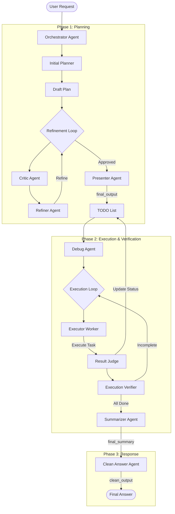

# Agentic System: Intelligent Multi-Agent Orchestrator

This project implements a robust, state-aware multi-agent system designed to automatically Plan, Execute, and Verify complex tasks using the Google ADK.

## 🏗️ System Architecture

The system operates as a sequential pipeline managed by an **Orchestrator**, chaining specialized agents for distinct phases of the lifecycle.



## 🧩 Key Components

### 1. Orchestrator (`meta_agents/orchestrator`)
The top-level controller that manages the session and queues the `SequentialAgent` pipeline. It ensures data flows seamlessly between agents via the `session.state`.

### 2. Planner (`sub_agents/planner`)
Responsible for breaking down user requests into actionable steps.
- **Initial Planner**: Generates a rough draft.
- **Refinement Loop**: Uses our custom **GenericLoop** pattern. A Critic reviews the plan and a Refiner improves it until it meets quality standards.
- **Presenter**: Formats the final approved plan into a structured Markdown checklist (`final_output`).

### 3. Executor (`sub_agents/executor`)
Responsible for carrying out the plan with self-correction.
- **Execution Loop**:
    - **Worker**: Picks the first unchecked item `[ ]`, executes it using DB/Tools, and reports results.
    - **Progress Update Agent (Judge)**: Strictly reviews the worker's result. Validates success, updates the checklist to `[x]`, and appends a result summary. If failed, adds a failure reason.
    - **Verifier**: Monitors the list. Exits the loop via `exit_loop_action()` only when all items are complete.
- **Summarizer**: Synthesizes the execution logs into a detailed final report (`final_summary`).
- **Clean Answer Agent**: Distills the detailed report into a direct, concise answer (`clean_output`) in Traditional Chinese.

## 💡 Custom Implementations

### GenericLoop vs. Standard ADK Loop
While this project is built on the **Google ADK**, we developed a custom `GenericLoop` class (`src/utils/agent_patterns.py`).
- **Problem**: The standard ADK loop agents lacked a robust mechanism for sub-agents to trigger an exit condition programmatically via tools (e.g., a Verifier deciding tasks are done).
- **Solution**: `GenericLoop` listens for a specific session state flag (default key: `loop_complete`). When a sub-agent calls the `exit_loop_action` tool, this flag is set, cleanly terminating the loop regardless of the iteration count.

## 🔄 State Awareness & Smart Skipping
The system is designed to be state-aware. If you ask a follow-up question in the same session:
1. **Planner** detects an existing approved plan and skips regeneration.
2. **Executor** detects all items are `[x]` (Completed) and instantly skips execution steps.
3. **Responders** (Summarizer/Clean Answer) re-run based on the *new question* and *existing data*, providing immediate answers without redundant work.

## 🚀 Getting Started

1. **Install Dependencies**:
   This project manages dependencies using `uv`.
   ```bash
   uv sync
   ```
2. **Run the Server**:
   ```bash
   adk web
   ```
3. **Interact**:
   Open the Web UI or send requests via API.
